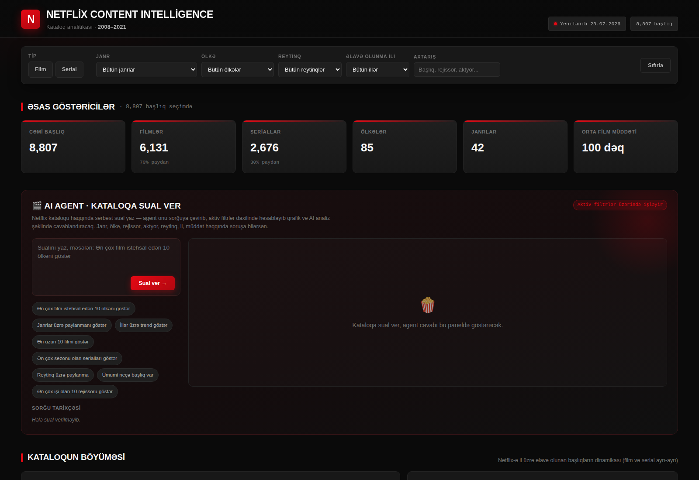

# 🎬 Netflix Content Intelligence Dashboard

Interactive, single-file HTML analytics dashboard exploring Netflix's global content catalog (8,807 titles, 2008–2021) — with an embedded **AI Agent** that answers natural-language questions about the data in real time.

**[🔴 Live Demo](#)** · (https://github.com/TuralMansurzada)

---

## 📌 Project Overview

Netflix's public content-metadata dataset contains rich but unstructured information — multi-value fields (genres, cast, countries), inconsistent duration formats across movies/TV shows, and a few raw data anomalies. This project turns that raw CSV into a fully interactive, filterable analytics tool that a content strategy or catalog team could actually use to answer questions like:

- Which countries and genres dominate the catalog, and how has that shifted over time?
- How has Netflix's rate of content acquisition grown year over year?
- Who are the most prolific directors and actors in the catalog?
- What's the typical movie runtime / TV show season count?

Rather than a static set of charts, the dashboard includes a **rule-based natural-language query agent** — type a question in plain language ("Ən çox film istehsal edən 10 ölkəni göstər") and it parses intent, runs the aggregation live against the filtered dataset, renders a chart, and generates a short written insight — with full query history and CSV export.

## 🧠 Key Skills Demonstrated

| Area | What's shown |
|---|---|
| **Data Cleaning** | Fixed a real data-shift bug (3 rows had duration values misplaced into the rating column), parsed inconsistent `duration` strings into separate movie-minutes / TV-season fields, handled multi-value columns (`director`, `cast`, `country`, `listed_in`) |
| **Data Modeling** | Split comma-joined multi-director credits into a proper exploded list instead of treating co-directed titles as one atomic category — a subtle bug that would otherwise undercount individual directors |
| **Exploratory Analysis** | Catalog growth trends, seasonality of content additions, genre/country/rating distributions, runtime and season-count distributions |
| **Front-end / Dataviz** | Chart.js visualizations, fully client-side filtering and re-aggregation (no backend), responsive dark UI themed to match the subject brand |
| **Product Thinking** | Designed an NLU-style query layer with intent parsing, generated pseudo-SQL for transparency, guarded against false-positive name matches (stopword filtering, word-boundary matching) |
| **QA / Testing** | Automated headless-browser checks (Playwright) verifying DOM state, chart rendering, and agent responses before shipping |

## 🛠️ Tech Stack

- **Data prep:** Python (pandas) — cleaning, feature engineering, JSON export
- **Frontend:** Vanilla JavaScript (no framework) + [Chart.js](https://www.chartjs.org/)
- **Deployment:** Single self-contained HTML file — no build step, no server required
- **Testing:** Playwright (headless Chromium) for automated UI/functional checks

## 📊 Dashboard Sections

1. **KPI strip** — total titles, movie/TV split, countries, genres, avg runtime
2. **AI Agent** — natural-language query interface with generated query, chart, AI-written analysis, CSV export, and query history
3. **Catalog growth** — titles added per year (movie vs TV) and monthly seasonality
4. **Content mix** — movie/TV ratio, rating distribution, release-decade distribution
5. **Genre & geography** — top 15 genres, top 15 producing countries
6. **Duration analytics** — movie runtime buckets, TV season-count distribution
7. **People** — top 15 directors and actors by title count
8. **Spotlight** — random title picker respecting active filters
9. **Full searchable/sortable data table** with pagination

All filters are global — every chart, KPI, and the AI Agent itself respect the currently active filter state.

## 📁 Data Source

[Netflix Movies and TV Shows dataset](https://www.kaggle.com/datasets/shivamb/netflix-shows) (Kaggle, public domain / community dataset).

## ⚠️ Known Limitations

- The AI Agent uses rule-based keyword/intent parsing rather than a hosted LLM (this is a static file with no backend — see *Future Work*)
- Name-matching for directors/actors uses word-boundary substring matching with a stopword filter; uncommon name collisions (e.g. a query mentioning a person not in the dataset but sharing a common name-part with someone who is) can occasionally produce a false match
- `country` and `director` fields are missing for ~9–30% of rows in the source data (Netflix's own metadata gaps, not introduced by this project) — these are excluded from relevant aggregations rather than imputed

## 🔮 Future Work

- Swap the rule-based agent for a real LLM call (e.g. Claude API) for open-ended Q&A
- Add a world map choropleth for the geography section
- Track dataset freshness with a scheduled re-scrape/update pipeline

---

Hazırladı: Tural Mansurzada · www.linkedin.com/in/tural-mansurzada-ab1a69387 · https://github.com/TuralMansurzada
